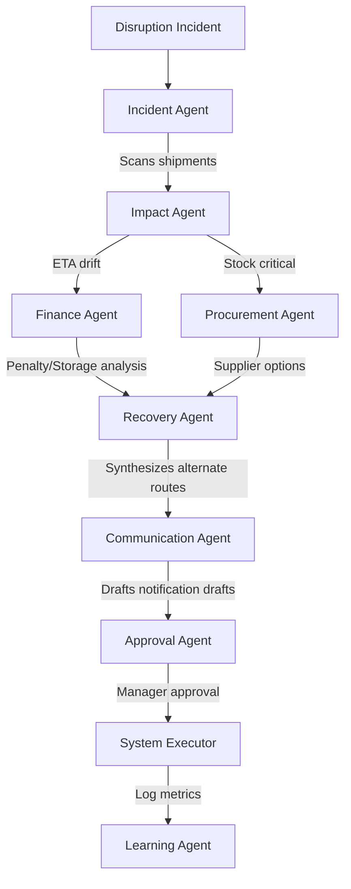

# Sentinel AI - Autonomous Supply Chain Recovery Platform

Sentinel AI is an autonomous logistics recovery SaaS platform that detects global supply chain disruptions (e.g. port strikes, weather delays, customs hold-ups), calculates business and financial impacts, generates recovery strategies, auto-drafts customer/supplier notifications, and runs approval workflows.

---

## 🏗️ Multi-Agent Architecture

Sentinel AI coordinates 8 specialized AI agents using a central coordinator. Each agent is responsible for a dedicated phase of the recovery pipeline:



### The 8 Agents
1. **Incident Agent**: Intersects incoming weather alerts or strike details with active shipment GPS trajectories.
2. **Impact Agent**: Computes downstream transit time delays and predicts ETA slip milestones.
3. **Finance Agent**: Estimates contractual late penalties, daily storage fees, and customer SLA breaches.
4. **Procurement Agent**: Identifies warehouse buffer stocks and locates alternative regional suppliers.
5. **Recovery Agent**: Simulates routing alternatives (Trieste rail links, air freight premiums, etc.) to minimize late time.
6. **Communication Agent**: Automatically writes customized alerts to clients (ETA update) and suppliers (document expedite).
7. **Approval Agent**: Enforces validation checks and registers manager authorization.
8. **Learning Agent**: Observes execution feedback to adjust regional baseline confidence metrics.

---

## 🛠️ Technology Stack

- **Frontend**: Next.js 15, React 19, TypeScript, TailwindCSS, Framer Motion
- **Backend**: FastAPI (Python), MongoDB (via Motor async driver), Redis (caching and pub/sub)
- **AI Orchestrator**: LangChain, OpenAI GPT-4o-mini models (with heuristic fallback engine when API keys are not supplied)
- **Deployment & Containers**: Docker, Docker Compose

---

## 🚀 Getting Started

Sentinel AI can be launched locally with a single click.

### Option 1: Docker Compose (Recommended)
1. Ensure **Docker Desktop** is running.
2. Double-click the `start.bat` script, or run:
   ```bash
   docker-compose up --build
   ```
3. Open your browser and navigate to:
   - **Frontend Console**: `http://localhost:3000`
   - **FastAPI API Docs**: `http://localhost:8000/docs`

### Option 2: Local Process Setup
If running without Docker, launch the services manually:

**1. Start Redis and MongoDB**
Ensure MongoDB is running on port `27017` and Redis is running on port `6379`.

**2. Start Backend FastAPI**
```bash
cd backend
pip install -r requirements.txt
python -m uvicorn app.main:app --port 8000 --reload
```

**3. Start Frontend Next.js**
```bash
cd frontend
npm install --legacy-peer-deps
npm run dev
```

---

## 🤖 AI Customization & OpenAI Key Setup
To run Sentinel AI with real GPT-4o-mini completions, configure your key:
1. Open the Control Console, navigate to the **Core Configs** tab in **System Settings**.
2. Save your `OpenAI API Key`.
3. Alternatively, set `OPENAI_API_KEY` in `docker-compose.yml` or a `.env` file inside the `backend` directory.

*Note: If no API key is set, Sentinel AI runs using its built-in heuristics engine, providing realistic structural responses for demonstration.*
